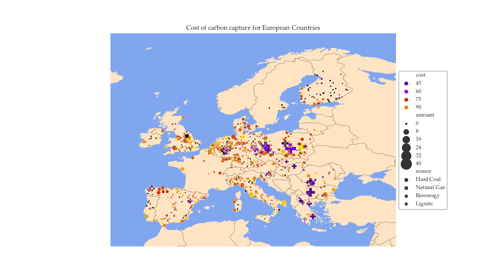
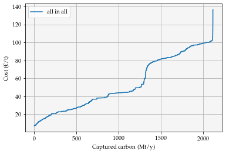
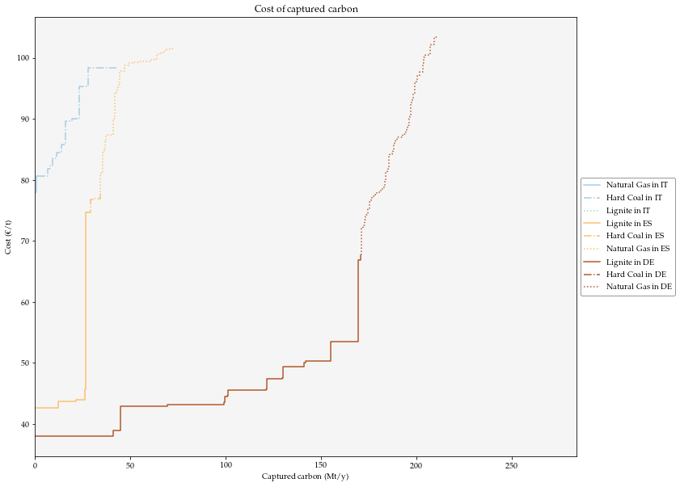
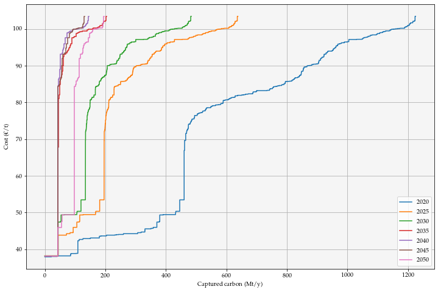

Basic Usage
===========

Distribution Data
^^^^^^^^^^^^^^^^^

After importing the api functions, to get the general processed power plant cost potential dataset run::

	>>>Distribution = cost_emission_distribution("basic")

Doing so will store a Distrbution instance from  where you can extract the data running::

	>>>data = Distribution.data
	
This will return a pandas dataframe. You can also plot the distribution in a map simply using the following instruction::

	>>>Distribution.plot()
	
	

Cost Potential Curves
^^^^^^^^^^^^^^^^^^^^^

Before you can start working with cost potential curves you need to import the curve module and matplotlib and create a distribution object.

.. code-block:: python

	from src.curveproduction.cost_potential_curve import *
	import matplotlib.pyplot as plt
	Distribution = cost_emission_distribution("basic")
	
Once you have done this you can create a single curve.

.. code-block:: python

	fig, ax = plt.subplots()
	data = distribution.data
	european_curve = CostCurve(data)
	european_curve.plot(ax)
	

But maybe it is more interesting for you to see some granularity, for doing so we use the CurveCollection class.
The way it works is by calling a constructor giving ISO codes of the territories we want to work with and the carbon sources
to consider

.. code-block:: python
	
	fig , ax = plt.subplots(figsize=(12,10))
	collection = CurveCollection.from_boundaries(distribution, ["DE", "ES", "IT"], ["Hard Coal", "Natural Gas", "Lignite"])
	collection.plot(ax)
	

Scenario representations
^^^^^^^^^^^^^^^^^^^^^^^^

The scenarios used in this tool are built based on the GECO scenarios, there are 3 of them a "Reference" scenario, "1.5°C" scenario and a "2C_M" scenario.
To see the curves run:

.. code-block:: python

	fig, ax = plt.subplots(figsize=(12,8))
	produce_scenario_collection(scenarios, "Reference", ax)
	
